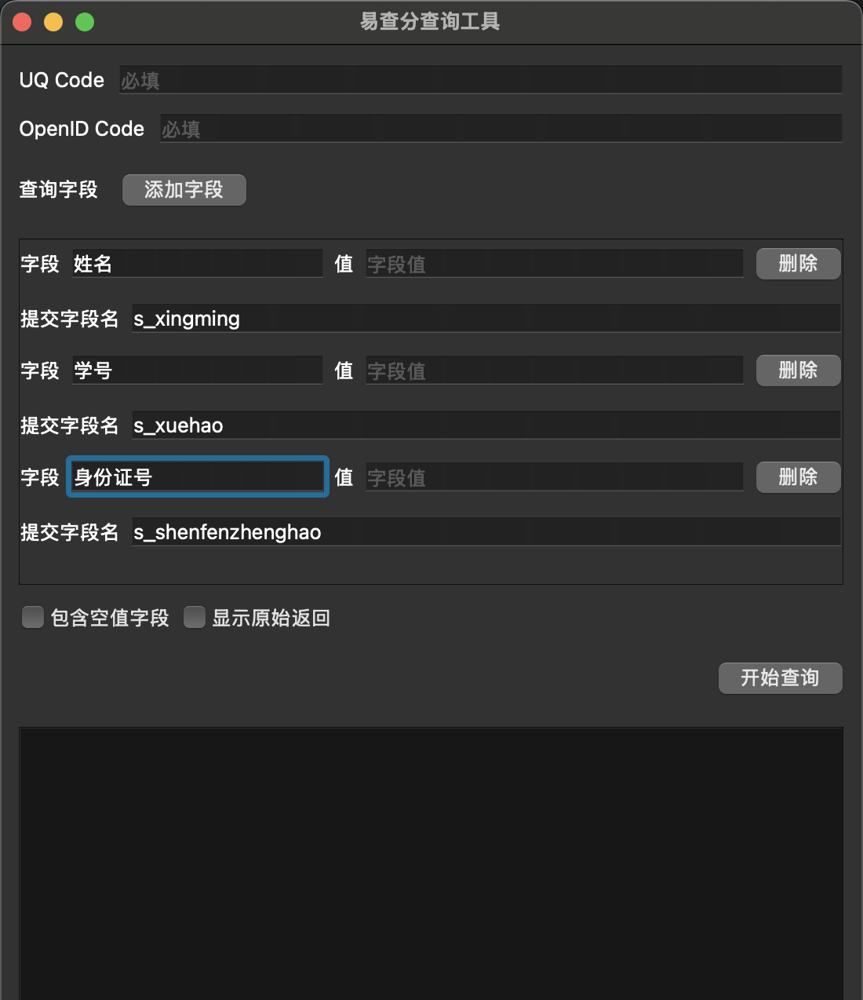
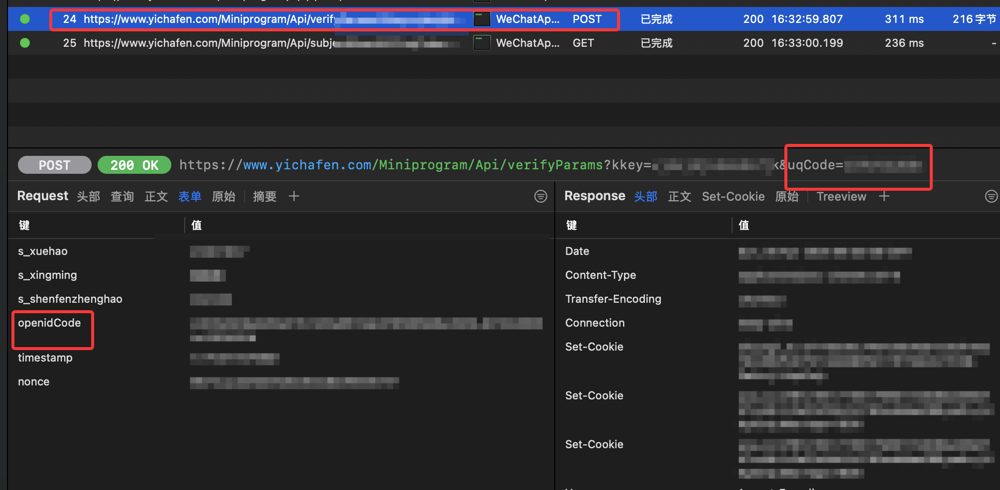

# “易查分”微信小程序爬虫查询工具


基于 PyQt6 的桌面工具，用来调用易查分微信小程序相关接口，提交查询字段并展示返回结果。


## 环境要求

- macOS、Windows、Linux
- Python 3.10 及以上

## 如何使用

```bash
cd /path/to/YiChaFen-Fethcher
```

macOS/Linux：

```bash
python3 -m venv .venv
source .venv/bin/activate
pip install -r requirements.txt
python3 main.py
```
 Windows：

```bash
python -m venv .venv
.venv\Scripts\activate
pip install -r requirements.txt
python main.py
```

## 字段说明

程序启动后，界面中有以下内容：

- `UQ Code`：必填，用于识别问卷的标志符，仅与与问卷有关
- `OpenID Code`：必填，用于识别用户身份的标志符，仅与微信账号有关
- `字段`：与小程序页面中显示的字段名相同，可以添加和删除
- `提交字段名`：自动生成，用于提交到接口的字段名

## UQ Code 与 OpenID Code 获取

由于和微信账号和问卷相关，需要使用 HTTP/HTTPS 分析工具自行获取，例如 Proxyman、Charles 等。

抓取一次在小程序中点击查询的请求，找到提交表单的 POST 方法，参数中包含 `UQ Code`，提交的表单中包含 `OpenID Code`。


